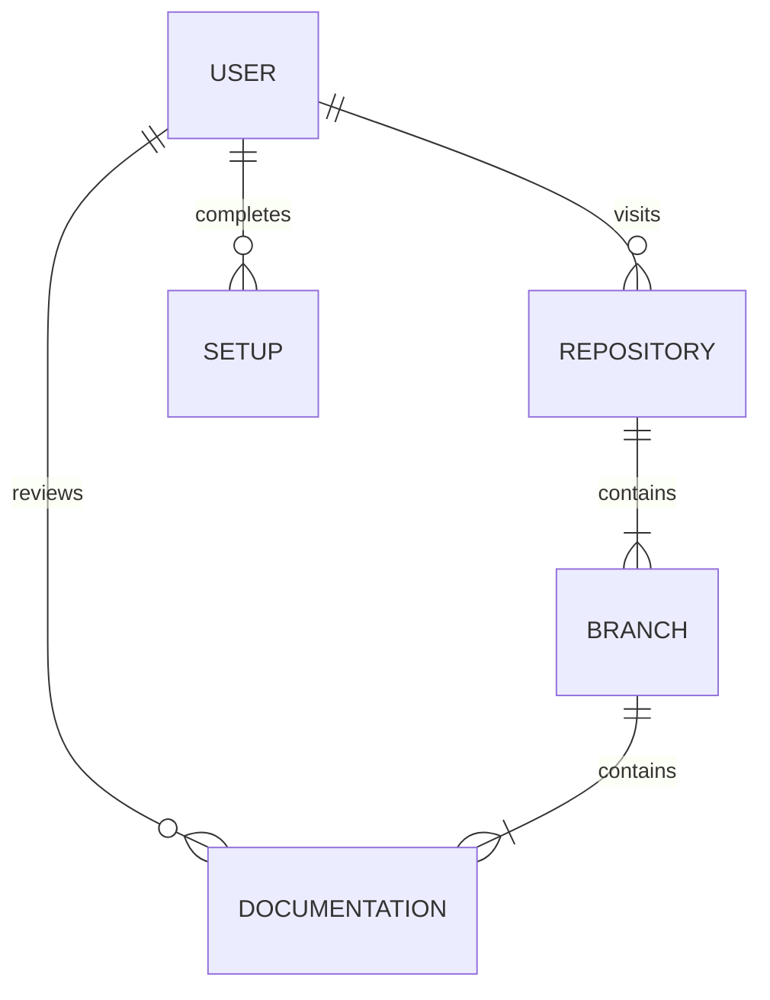

# CSC289-Flashcard-Generator

## Flashcard Generator Application 

### Project Overview

The following project utilizes an **Agile** approach to software testing and development. This project will serve users/clients by giving them the means of creating their own flashcard decks. The project demonstrates how to properly operate platforms such as **AWS** and **AZURE**. The project will also implement behavior-driven (**BDD**) software development frameworks like **Django**. Expect to find information and resources on web application testing for the following:

 **BDD**: Behavior-Driven Development
 **TDD**: Test-Driven Development
 **API**: Application Programming Interface
 **CI/CD**: Continuous Integration and Development
 **Django**: Create web applications

# **Team Member Details** 

|**Name**|**Email**|**Role**|
| :- | :- | :- |
|Derek Williford|dwwilliford@my.waketech.edu|Project Manager|
|Arley Zamora|agzamora@my.waketech.edu|Front-End Designer|
|John Kappler|jakappler1@my.waketech.edu|UX Designer|
|Katelyn Marie Doyle|kdoyle1@my.waketech.edu|Front-End Developer|
|Kevin Bialecki|kbialecki@my.waketech.edu|Cloud Developer & API|
|Mark Patrick Johnson|mpjohnson1@my.waketech.edu|Documentation & Testing|
|Raegan Durdin|rdurdin@my.waketech.edu|Django & DevOps|
|Noah Garner|njgarner@my.waketech.edu|Django & Quality Assurance|

## Features

* Local server powered by Django for testing and learning software tools and techniques.
* Cloud-based server powered by AWS for deployment and public use. 
* Comprehensive documentation following **Agile** principles.
* Resources on relevant software testing frameworks and practices.

## Visual aid diagram:

## User instructions

1. Clone the project to your local machine and configure interpreter.
2. Reference lab documentation/information.
2. Download the necessary files, in accordance to their version/dependencies.
3. Analyze and review branch contents.
4. Begin using the correlating software or framework.

## Sections
| Section | Topic           |
| ------- | --------------  |
| 1       | Database / SQL  |
| 2       | BDD / Django    |
| 3       | API / HTML      |
| 4       | Cloud / AWS     |

### Expectations
Identify errors, inconsistencies, or other noteworthy improvements and document them.
Communicate openly. Notify others of resolved issues and provide feedback.
Monitor objectives, goals, and overall progress on **GitHub** and **Trello**.

## Instructions for connecting to Database
### Installing MySQL
1. Install MySQL Ver 8.x
2. Create your MySQL root password (Write this password down and **DO NOT** forget it)
4. Follow regular install procedures
5. Once installed, open Command Prompt and connect to MySQL.
   - mysql -u root -p
     Will Prompt for password (Enter password)
   - If error is prompted, Make sure you are CD to the correct path (MySQL Shell\Bin). I recommend watching this video, it will make life easier [https://youtu.be/kj_oW8cx6Bs?si=ZjMtV0Dpg8X3Ii1w] 

### Connecting to GitHub in CMD
1. Create directory - mkdir c:\code
2. Go to directory - cd c:\code
3. Create a token(Classic) in GitHub setting-Developer Settings-Personal Access Tokens-Tokens(Classic)-Generate New Token
4. After creating a token, back to the command prompt - git clone https://[Token]@github.com/njgarner/CSC289-Flashcard-Generator.git (Insert your token address)
5. Checkout - git checkout main
6. Pull - git pull

### Creating and Running Database Schema
1. cd C:\Code\CSC289-Flashcard-Generator\sql
2. Before creating schema, edit create_schema.sql to adjust application username and password (Line number 2) **That is the username and password you are going to put in the setting.py file for Django**
3. mysql -u root -p < create_schema.sql
4. Will prompt for root password (Enter Password)

### Dropping Database (For ReRun)
1. cd C:\Code\CSC289-Flashcard-Generator\sql
2. mysql -u root -p < drop_schema.sql
3. Will prompt for root password (Enter Password)

## Setting up Django locally

In order to access the sqldatabase, you have to navigate to the file "settings.py" and fill in the correct info, including these 3 things:

DATABASES = {
    'default': {
        'NAME': 'flashcard_db',
        'USER': 'your_user',
        'PASSWORD': 'your_password',
    }
}

^^^ This is before we have aws configured

### Install Required Python Packages
py -m pip install Django cryptography pymysql

### Start the Service
cd C:\Code\CSC289-Flashcard-Generator\mysite

python manage.py runserver 0.0.0.0:8000

What we have working:

We can now view these pages:

http://127.0.0.1:8000/create_deck

http://127.0.0.1:8000/login_user

http://127.0.0.1:8000/home

http://127.0.0.1:8000/library

http://127.0.0.1:8000/settings

http://127.0.0.1:8000/signup_user

Things we can do (currently without user authentication):

- Add a flashcard deck
- View what decks we have in the library, as well as the flashcards that are in the deck
- Delete a deck
- Add a flashcard to a specific deck

### AWS Environment
AWS instance is running 24/7 with static IP. On top of every hour latest changes from main get pulled and service gets restarted.

http://ec2-54-172-119-63.compute-1.amazonaws.com:8000/login_user?next=/home

