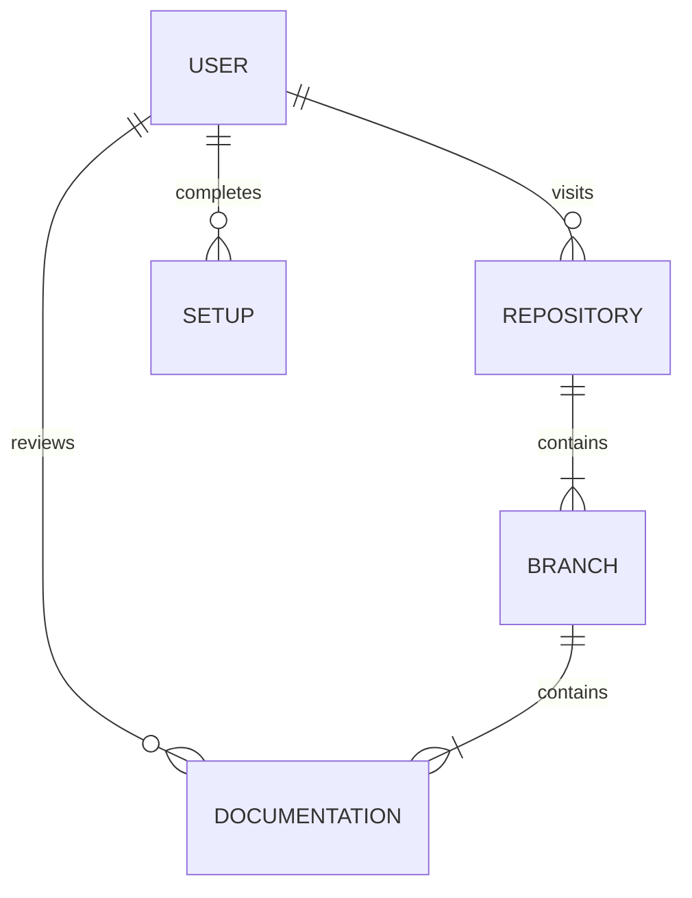

# CSC289-Flashcard-Generator

## Flashlite (Flashcard Generator Application)

Table of Contents

- [Project Overview](#project-overview)
- [Features](#features)
- [Sections](#sections)
- [Expectations](#expectations)
  - [Visual Aid Diagram](#visual-aid-diagram)
  - [User Instructions](#user-instructions)
  - [Instructions for connecting to Database](#instructions-for-connecting-to-database)
  - [Installing MySQL](#installing-mysql)
  - [Dropping Database](#dropping-database)
  - [Setting up Django locally](#setting-up-django-locally)
  - [Install Required Python Packages](#install-required-python-packages)
- [Local Server Page Links](#local-server-page-links)
- [AWS Environment](#aws-environment)

### Project Overview

Flashlite is a web-based flashcard platform developed using an **Agile** methodology, with a strong focus on iterative development, testing, and user feedback. The goal of the project is to empower users—students, educators, and lifelong learners—to easily create, customize, and study their own flashcard sets.

The platform is built using the **Django** framework, incorporating behavior-driven development (**BDD**) practices to ensure features align with real user needs. It also demonstrates practical implementation of cloud technologies, including hosting and deployment on platforms such as **AWS** and **Azure**, ensuring scalability and reliability.

Through this project, we aim to deliver a user-friendly, accessible, and educational tool that highlights modern software development techniques and infrastructure management.

---

> ### **``Throughout the Flashlite project, you can expect to find resources, documentation, and practical implementations related to key software development concepts and tools, including:``**
> **BDD**: Structuring development around user behavior and expected outcomes, ensuring features align with user needs.
 **TDD**: Writing tests before implementing functionality to promote clean, reliable, and maintainable code.
 **API**: Implementing and interacting with APIs to support communication between the frontend, backend, and external services.
 **CI/CD**: Automating the testing and deployment pipeline to support rapid, reliable updates.
 **Django**: A robust Python-based web framework used to build and manage the core application structure of Flashlite.

---

# **Team Member Details** 

|**Name**|**Email**|**Role**|
| :- | :- | :- |
|Derek Williford|dwwilliford@my.waketech.edu|Project Manager|
|Arley Zamora|agzamora@my.waketech.edu|Front-End Designer|
|John Kappler|jakappler1@my.waketech.edu|UX Designer|
|Katelyn Marie Doyle|kdoyle1@my.waketech.edu|Front-End Developer|
|Kevin Bialecki|kbialecki@my.waketech.edu|Cloud Developer & API|
|Mark Patrick Johnson|mpjohnson1@my.waketech.edu|Documentation & Testing|
|Raegan Durdin|rdurdin@my.waketech.edu|Django & DevOps|
|Noah Garner|njgarner@my.waketech.edu|Django & Quality Assurance|

## Features

* **Local Development Server:** Powered by Django, enabling hands-on testing, development, and experimentation with modern web application techniques.
* **Cloud Deployment:** Hosted on a cloud-based server via AWS, providing reliable access for public users and real-world deployment experience.
* **Agile Documentation:** Thorough and evolving documentation aligned with Agile principles, ensuring transparency, iteration, and collaboration throughout the development lifecycle.
* **Testing & Framework Resources:** Includes guidance and examples on software testing practices such as **BDD**, **TDD**, and usage of relevant tools to ensure code quality and maintainability.

## Sections
| Section | Topic           |
| ------- | --------------  |
| 1       | Database / SQL  |
| 2       | BDD / Django    |
| 3       | API / HTML      |
| 4       | Cloud / AWS     |

### Expectations
**Identify and Document Issues:** Actively look for errors, inconsistencies, or areas for improvement, and clearly document them for the team.

**Maintain Open Communication:** Share updates on resolved issues, offer constructive feedback, and stay engaged with team discussions.

**Track Progress:** Regularly monitor project objectives, milestones, and task completion using tools like **GitHub** and **Trello** to ensure alignment.

## Visual aid diagram:

# User instructions

1. **Clone the Repository**
   
Clone the project to your local machine using Git, and configure your Python interpreter as needed.

2. **Review Lab Documentation**
   
Refer to the provided lab materials and documentation for setup guidance.

3. **Download Dependencies**
   
Install all required files and packages according to the specified versions in the ``requirements.txt`` or relevant setup files.

``pip install -r requirements.txt``

4. **Review Branch Contents**
   
Explore and analyze the contents of each branch to understand feature development and version differences.

``git checkout main``
``git pull``

5. **Launch and Use the Framework**
    
Begin working with the associated software or framework, following project-specific instructions and best practices.

## Instructions for connecting to Database
### Installing MySQL

Download MySQL Installer 8.x:
MySQL Installer Download
(Use mysql-installer-community-8.0.41.0.msi)

`` https://dev.mysql.com/downloads/windows/installer/8.0.html ``

Create a root password — write this down and do not forget it.

Choose Full Installation during setup and proceed with default options.

After installation, open Command Prompt and connect to MySQL:

`` mysql -u root -p ``

If you receive an error, ensure your environment variables include:

``C:\Program Files\MySQL\MySQL Shell 8.0\bin\``
``C:\Program Files\MySQL\MySQL Server 8.0\bin\``

To verify installation:

`` mysql --version ``

 
   Recommended Setup Video:
   
   [https://youtu.be/kj_oW8cx6Bs?si=ZjMtV0Dpg8X3Ii1w] 

### Connecting to GitHub in CMD

1. Create and navigate to a directory:

`` mkdir C:\code ``
`` cd C:\code ``

2. Generate a GitHub Personal Access Token:
GitHub → Settings → Developer Settings → Personal Access Tokens → Generate New Token (Classic)

3. Clone the repository with your token:

`` git clone https://[TOKEN]@github.com/njgarner/CSC289-Flashcard-Generator.git `` 

*(Replace [Token] with your Personal Access Token)*

4. Navigate into the project and pull the latest code:

`` cd CSC289-Flashcard-Generator 
   git checkout main 
   git pull ``

### Creating and Running Database Schema
1. Navigate to the SQL folder:

`` cd C:\Code\CSC289-Flashcard-Generator\sql ``

2. Update create_schema.sql to reflect your MySQL credentials (lines 2 & 3):
   
`` CREATE USER 'root'@'localhost' IDENTIFIED WITH mysql_native_password BY 'your_password'; 
   GRANT ALL PRIVILEGES ON flashcard_db.* TO 'root'@'localhost'; ``

**That is the username and password you are going to put in the setting.py and \_\_init__.py file for Django**

3. Execute the schema creation:

``mysql -u root -p < create_schema.sql``

4. Enter your root password when prompted.

### Dropping Database
5. From the same SQL directory:

`` mysql -u root -p < drop_schema.sql ``
Recreate the schema afterward if dropped.

## Setting up Django locally

1. Open settings.py and __init__.py.

2. Replace the MySQL credentials under the DATABASES configuration with your own:

 `` 'USER': 'root',
'PASSWORD': 'your_password', ``

Ensure that both files use the same credentials that you set in MySQL and the SQL schema script.

You should have something that resembles the following:
___

``

    DATABASES = {
      'default': {
        'ENGINE': 'django.db.backends.mysql',
        'NAME': 'flashcard_db',
        'USER': 'root', (Your User)
        'PASSWORD': 'waketech', (Your Password)
        'HOST': 'localhost',
        'PORT': '3306',
    }

``
        
___

^^^ **This is for local server access, not AWS**

### Install Required Python Packages

From the Command Prompt:

``py -m pip install Django cryptography pymysql``

### Start the Service
``cd C:\Code\CSC289-Flashcard-Generator\mysite``

``python manage.py makemigrations``

``python manage.py migrate``

``python manage.py runserver 0.0.0.0:8000``

___

### Local Server Page Links:

http://127.0.0.1:8000/

http://127.0.0.1:8000/create_flashcard/

http://127.0.0.1:8000/settings/

http://127.0.0.1:8000/library/

http://127.0.0.1:8000/login_user

http://127.0.0.1:8000/signup_user

___

### AWS Environment
AWS instance is running 24/7 with static IP. On top of every hour latest changes from main get pulled and service gets restarted.

http://ec2-54-172-119-63.compute-1.amazonaws.com:8000/login_user?next=/home
