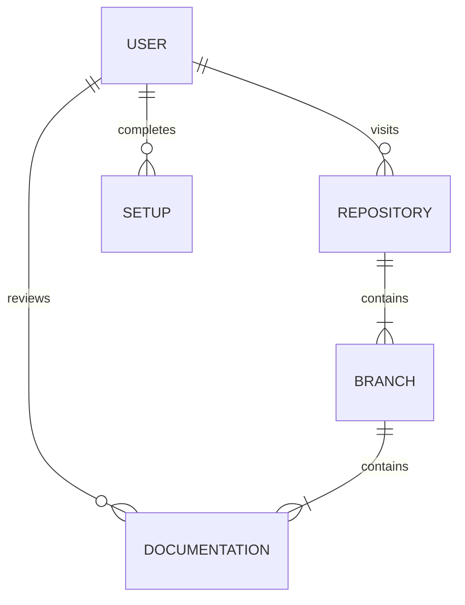

# CSC289-Flashcard-Generator

## Flashcard Generator Application 

### Project Overview

The following project utilizes an **Agile** approach to software testing and development. This project will serve users/clients by giving them the means of creating their own flashcard decks. The project demonstrates how to properly operate platforms such as **AWS** and **AZURE**. The project will also implement behavior-driven (**BDD**) software development frameworks like **Django**. 

---

> ### **``Expect to find information and resources for the following:``**
> **BDD**: Behavior-Driven Development
 **TDD**: Test-Driven Development
 **API**: Application Programming Interface
 **CI/CD**: Continuous Integration and Development
 **Django**: Web Application Creation Software

---

# **Team Member Details** 

|**Name**|**Email**|**Role**|
| :- | :- | :- |
|Derek Williford|dwwilliford@my.waketech.edu|Project Manager|
|Arley Zamora|agzamora@my.waketech.edu|Front-End Designer|
|John Kappler|jakappler1@my.waketech.edu|UX Designer|
|Katelyn Marie Doyle|kdoyle1@my.waketech.edu|Front-End Developer|
|Kevin Bialecki|kbialecki@my.waketech.edu|Cloud Developer & API|
|Mark Patrick Johnson|mpjohnson1@my.waketech.edu|Documentation & Testing|
|Raegan Durdin|rdurdin@my.waketech.edu|Django & DevOps|
|Noah Garner|njgarner@my.waketech.edu|Django & Quality Assurance|

## Features

* Local server powered by Django for testing and learning software tools and techniques.
* Cloud-based server powered by AWS for deployment and public use. 
* Comprehensive documentation following **Agile** principles.
* Resources on relevant software testing frameworks and practices.

## Sections
| Section | Topic           |
| ------- | --------------  |
| 1       | Database / SQL  |
| 2       | BDD / Django    |
| 3       | API / HTML      |
| 4       | Cloud / AWS     |

### Expectations
Identify errors, inconsistencies, or other noteworthy improvements and document them.
Communicate openly. Notify others of resolved issues and provide feedback.
Monitor objectives, goals, and overall progress on **GitHub** and **Trello**.

## Visual aid diagram:

# User instructions

1. Clone the project to your local machine and configure interpreter.
2. Reference lab documentation/information.
2. Download the necessary files, in accordance to their version/dependencies.
3. Analyze and review branch contents.
4. Begin using the correlating software or framework.

## Instructions for connecting to Database
### Installing MySQL
1. Install MySQL Ver 8.x
 
`` https://dev.mysql.com/downloads/windows/installer/8.0.html ``

``(mysql-installer-community-8.0.41.0.msi)``

2. Create your MySQL **root** password. (Write this password down and **DO NOT** forget it)

4. Opt for a full installation and follow default install procedures.
5. Once installed, open your Command Prompt (CMD) and connect to MySQL.

   `` mysql -u root -p``

     This will prompt you for your **root** password. (Enter password)
   - If an error is prompted, make sure to set your environment variables under 'path' to include: (MySQL Shell 8.0\bin & MySQL Server 8.0\bin). 
   - You can check if MySQL installed successfully by running the following Command Prompt:
   ``mysql --version``
 
   I recommend watching this video, it will make life easier:
   
   [https://youtu.be/kj_oW8cx6Bs?si=ZjMtV0Dpg8X3Ii1w] 

    
    Alternatively, you can search your Windows Start for:

    ``Edit the system environment variables``
    
    Upon opening your system properties, choose:
    
    ``Environment Variables...``
    
    Select the User Variable called: ``Path`` and then ``New``
    
    Add the following paths:
    
    ``C:\Program Files\MySQL\MySQL Shell 8.0\bin\``
    
    ``C:\Program Files\MySQL\MySQL Server 8.0\bin``
    

### Connecting to GitHub in CMD
1. Create directory:

``mkdir c:\code``

2. Go to directory:

 ``cd c:\code``

3. Create a Token(Classic) in GitHub -> Settings -> Developer Settings -> Personal Access Tokens -> Tokens(Classic) -> Generate New Token
4. After creating a token, return to your Command Prompt:

``git clone https://[Token]@github.com/njgarner/CSC289-Flashcard-Generator.git`` 

*(Replace [Token] with your Personal Access Token)*

5. Checkout:

``git checkout main``

6. Pull:

``git pull``

### Creating and Running Database Schema
1. In the Command Prompt:

``cd C:\Code\CSC289-Flashcard-Generator\sql``

2. Before creating schema, edit create_schema.sql to adjust application username and password:

(Line numbers 2 & 3) 

For Example:

``CREATE USER 'root'@'localhost' IDENTIFIED WITH mysql_native_password BY 'waketech';``

``GRANT ALL PRIVILEGES ON flashcard_db.* TO 'root'@'localhost';``

**That is the username and password you are going to put in the setting.py and \_\_init__.py file for Django**

3. Return to Command Prompt

``mysql -u root -p < create_schema.sql``

4. This will prompt you for your **root** password (Enter Password)

### Dropping Database (For ReRun)
1. In the Command Prompt:

``cd C:\Code\CSC289-Flashcard-Generator\sql``

 ``mysql -u root -p < drop_schema.sql``

3. This will prompt you for your **root** password (Enter Password)

4. Make sure to create the database schema again if dropped successfully.

## Setting up Django locally

In order to access the MySQL database locally, you have to navigate to the files "settings.py" and "\_\_init__.py" and fill in **YOUR** SQL ``'USER'`` and ``'PASSWORD'`` credentials. 

You should have something that resembles the following:
___

``

    DATABASES = {
      'default': {
        'ENGINE': 'django.db.backends.mysql',
        'NAME': 'flashcard_db',
        'USER': 'root', (Your User)
        'PASSWORD': 'waketech', (Your Password)
        'HOST': 'localhost',
        'PORT': '3306',
    }

``
        
___

^^^ **This is for local server access, not AWS**

### Install Required Python Packages

From the Command Prompt:

``py -m pip install Django cryptography pymysql``

### Start the Service
``cd C:\Code\CSC289-Flashcard-Generator\mysite``

``python manage.py migrate``

``python manage.py runserver 0.0.0.0:8000``

___

### What we have working:

#### We can now view these pages:

http://127.0.0.1:8000/create_deck

http://127.0.0.1:8000/login_user

http://127.0.0.1:8000/home

http://127.0.0.1:8000/library

http://127.0.0.1:8000/settings

http://127.0.0.1:8000/signup_user

#### Things we can do (currently without user authentication):

- Add a flashcard deck
- View what decks we have in the library, as well as the flashcards that are in the deck
- Delete a deck
- Add a flashcard to a specific deck

___

### AWS Environment
AWS instance is running 24/7 with static IP. On top of every hour latest changes from main get pulled and service gets restarted.

http://ec2-54-172-119-63.compute-1.amazonaws.com:8000/login_user?next=/home
