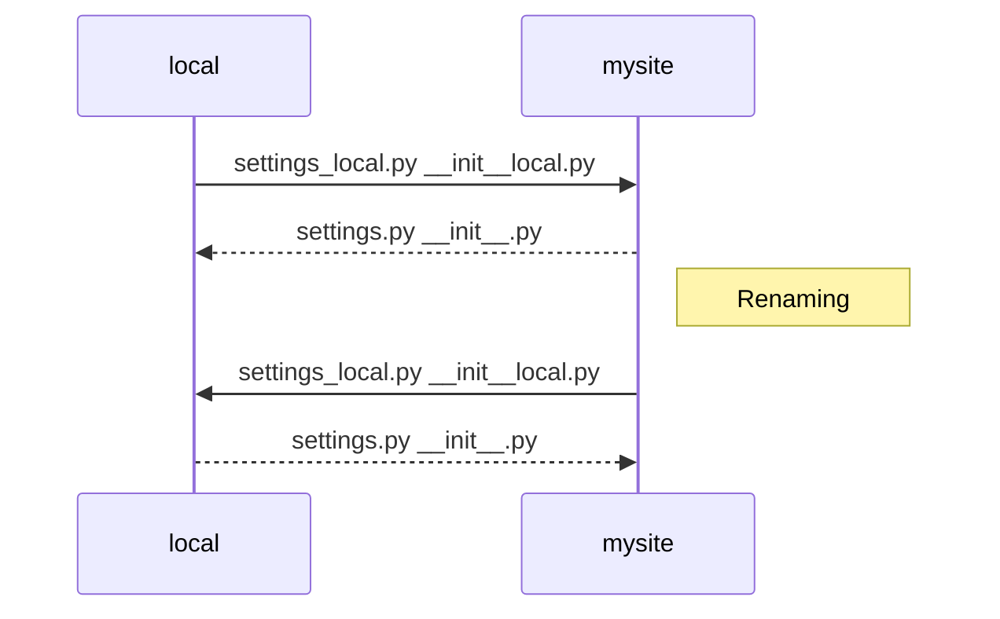

# Flashcard Generator User Guide

## Overview

The following guide will demonstrate how to access the project locally and using a cloud-based server powered by AWS. This guide will explain the differences between the two servers, their testing procedures, and their information.

---

> ## **``Table of Contents``**

> ###  *Server Details*: <small>The characteristics of the separate servers</small>
> ###  *Testing Protocol*: <small>Guide to testing and pushing changes</small>
> ###  *Diagram*: <small>Visual aid on server switching</small>

> ###  *User Instructions*: <small>Directions for accessing local and cloud servers</small>
> ###  *Using local*: <small>How to start a local server</small>
> ###  *Using AWS*: <small>How to start a AWS server</small>

> ###  *Database Templates*: <small>Backup code for database credentials</small>

---

# **Server Details** 

|**Server**|**Provider**|**URL**|
| :- | :- | :- |
|Local|Django|http://127.0.0.1:8000|
|Cloud|AWS|http://ec2-54-172-119-63.compute-1.amazonaws.com:8000/login_user?next=/home|

## Testing Protocol
Think of the local server as a testing server. Changes you make to the server on your local PC won't affect others. You should ensure the code works locally before pushing it to AWS. On the cloud, we share a site and a database. If someone pushes broken code to the AWS server, **everyone suffers**. 

We must test things locally before updating the code to cloud/AWS.

If new code makes it to the main branch, it should be because it functions and does not conflict with existing code or cause errors. 

* **Remember** to use the **local server** for **testing** and **learning** code techniques.

* **Remember** to use the **cloud-based server** after local tests **pass**.

### Diagram:

## User Instructions

1. Download the 'local' folder from the main branch.
2. Insert the 'local' folder inside your 'mysite' folder.
3. Open the files contained within the 'local' folder in a code editor.
4. Analyze and review code contents.
5. Begin filling in your local database credentials where directed.
6. Save the files once you've entered correct MySQL database credentials.

### Using Local
Whenever you want to use the local server. Take the **\_\_init__.py** and **settings.py** files out of the **mysite** folder. 

Then, put them in the **local folder**.

Your **local folder** should now contain **four files**:

``__init__.py ``
``__init__local.py ``
`` settings.py`` 
`` settings_local.py``

Put the **__init__local.py** and **settings_local.py** files in the **mysite** folder.

Your **mysite folder** should now contain:

``__init__local.py ``
``settings_local.py``

Rename the files so they no longer have the word **local**. (\_\_init__.py & settings.py)

You should follow the same CMD procedures for running a local project:

``py manage.py migrate ``

``py manage.py runserver ``

**Remember** the files contained within your **local folder** are now the original **AWS** files.

If successful, you can proceed with using the local server. Doing this will not affect your access to the AWS site, as the local server exists separately. Once you finish or are ready to push changes, proceed to the next section on **Using AWS**.  

### Using AWS

You likely won't push the **\_\_init__.py** or **settings.py** files to GitHub. These files will rarely need to experience changes. But, If you were ever going to push these files to GitHub, on their own or in combination with other files, you would need to change the local files back to their AWS versions before doing so.

When you want to return to the AWS server, rename the files to include local again:

``__init__local.py ``
``settings_local.py ``

Now, the files can go to the **local folder**, which should have **four files** again.

``__init__.py ``
``__init__local.py ``
`` settings.py`` 
`` settings_local.py``

The original **AWS** files should go in the **mysite** folder.

| Folder (mysite)| Folder (local)     |
| -------------- | ------------------ |
| \_\_init__.py  | \_\_init__local.py |
| settings.py    | settings_local.py  |

Now, uploading these files won't cause errors with the AWS server. When you need to test again, revisit the **Using Local** section and repeat the process to get back to the local server.

# Database Templates

**The following is a record.** 

**Treat this as a precautionary measure only.**

In case the original database code is overwritten, lost, or altered.

You can find the code for the cloud and local database below. 

## Django / Local Database

### \_\_init__.py

``

    database_cred = {

        "host": "localhost",

        "user": "root",

        "password": "waketech",

        "database": "flashcard_db",

        "autocommit": True,

        "cursorclass": pymysql.cursors.DictCursor,

    }
``

### settings.py

``

    DATABASES = {
      'default': {
        'ENGINE': 'django.db.backends.mysql',
        'NAME': 'flashcard_db',
        'USER': 'root',
        'PASSWORD': 'waketech',
        'HOST': 'localhost',
        'PORT': '3306',
    }

``

## AWS Database 

### \_\_init__.py

``

    database_cred = {

        "host": "localhost",

        "user": "flashcarduser",

        "password": "Group1!!",

        "database": "flashcard_db",

        "autocommit": True,  # making sure updated, inserts, deletions are commited for every query

        "cursorclass": pymysql.cursors.DictCursor,

    }

``

### settings.py

``

    DATABASES = {
      'default': {
        'ENGINE': 'django.db.backends.mysql',
        'NAME': 'flashcard_db',
        'USER': 'flashcarduser',
        'PASSWORD': 'Group1!!',
        'HOST': 'localhost',
        'PORT': '3306',
    }
``
