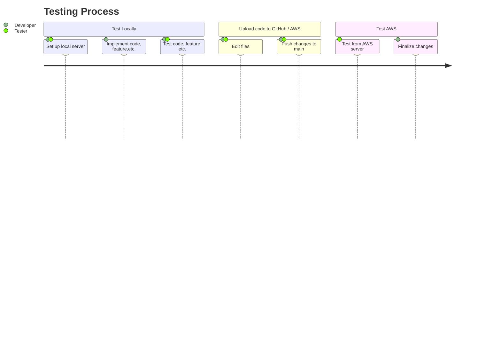

# Flashcard Generator Test Plan Template

## Overview

The following will outline how to test our product, including what tools and strategies to use. Expect to find resources, templates, and success criteria for testing specific new features and software. 


This document will ensure you make solid test plans and understand the testing phases and developmental processes necessary for delivering a successful product.


**Remember to test locally first before uploading code to our cloud-based server.**

Please review the **TESTGUIDE.md** document for information on going between servers for testing purposes.

---

> ## **``Table of Contents``**

> ### <br>*Server Details*: <small>The characteristics of the separate servers</small>
> ### <br>*Introduction*: <small>General testing information</small>
> ### <br>*Test Risks / Issues*: <small>Identify and avoid the risks</small>
> ### <br>*Diagram*: <small>Visual aid on testing processes</small>


> ### <br>*Testing Scope*: <small>Defines the extent of testing</small>
> ### <br>*Test Plans / Strategies*: <small>How testing will be conducted</small>
> ### <br>*Using GitHub*: <small>How to use GitHub for testing purposes</small>

> ### <br>*Test Case Templates*: <small>Templates for use in making test cases</small>


---

# <a name="_x7m16otabon9"></a><a name="_64tqgr9am01"></a>**Server Details** 

|**Server**|**Provider**|**URL**|
| :- | :- | :- |
|Local|Django|http://127.0.0.1:8000|
|Cloud|AWS|http://ec2-54-172-119-63.compute-1.amazonaws.com:8000/login_user?next=/home|


## Introduction
The purpose of the Test Plan for this specific project is to ensure we fulfill the deliverables outlined in our Statement of Required Services (SRS). By referencing the requirements specified in the SRS, we can define what features and software to test and how to test them most effectively.

The responsibility falls on both the tester and developer. At least one person should test a developer's code locally before allowing it to reach the main branch. In certain circumstances, like when a developer finishes code for a core feature, developers will act as separate testers and test their code. The decision to test code collaboratively is situational. But, a passing unit test always confirms that the code functions as it should.

* **Remember** to use the **local server** for **testing** and **learning** code techniques.


* **Remember** to use the **cloud-based server** after local tests **pass**.

## Test Risks / Issues

Here are the risks associated with our test plan and their mitigation strategies.

| Test Plan Risk          | Mitigation Strategy                                               |
| ----------------------- | ----------------------------------------------------------------- |
| Incomplete Requirements | Specify clear requirements for testing.                           |
| Inadequate Resources    | Adjust the scope of testing and priortize.                        |
| Undefined Scope         | Identify the goal and determine the purpose.                      |
| Overwriting Code        | Utilize Git or other version control software.                    |
| Insufficient Tools      | Resort to manual testing techniques like exploratory testing.     |
| Conflicting Code        | Communicate the problem and use version control.                  |
| Lack of Testing         | Ask team members to test a newly-implemented feature or function. |
| Delayed Testing         | Work collaboratively and create user stories.                     |

## Diagram:



## Testing Scope

Here is information regarding the items/features/functions that will be tested, how they'll be tested, when, and who will test them.

**Items not in the scope of this test plan will be listed seperately.**

| Test Item              | Description                            | Date | Responsibility       |
| ---------------------- | -------------------------------------- | ---- | -------------------- |
| Deck                   | Test if user can create decks.         | N/A  | Tester & Developer   |
| Flashcard              | Test if user can create flashcards.    | N/A  | Tester & Developer   |
| Publishing             | Test if user can publish decks.        | N/A  | Tester               |
| Navigation             | Test if user can navigate efficiently. | N/A  | Tester               |
| Pop-ups                | Test if pop-ups function and appear.   | N/A  | Tester               |


### Test Levels and Test Types / Strategies

Here are the test plans and their strategies that will help prioritize the testing efforts and explain the techniques and approaches necessary for success.

| Test Level | Description                                                                      | Strategy                                                 |
| ---------- | -------------------------------------------------------------------------------  | -------------------------------------------------------- |
| System     | Tests a complete and fully integrated software product.                          |  Cover all the paths.                                    | 
| Acceptance | Tests whether it meets user needs and Software Requirements Specification (SRS). |  Determine if it is ready for release.                   |


| Test Type  | Description                                              | Strategy                                                     |
| ---------- | -------------------------------------------------------- | ------------------------------------------------------------ |
| Functional | Verifies that features and functions work as intended.   | Review and validate each feature.                            |
| Usability  | Makes the design more user-friendly and intuitive.       | Identify feedback and improve the user experience.           |
| Regression | Ensures new code has not broken previously working code. | Take a risk-based approach and diagnose high-priority areas. |

There are many things to consider when aiming to test effectively. A well-structured software test case should cover only the functional requirements needed to replicate it. Sometimes, a unit test will be used, and other times, a user story, but all tests need to be documented in some way. 

## Using GitHub / Git

### GitHub Issues
GitHub Issues are a versatile item designed to help, plan, discuss, and track testing. In the repository, you can access GitHub Issues to document bugs or mandate testing for specific code and features. Users can assign these issues to themselves and other specific team members. 

GitHub Issues can be read in markup languages like Markdown, meaning that the templates provided in this document will work with GitHub Issues. GitHub Issues can be either open or closed. Open indicates that testing is ongoing, and closed is for finished testing. It is a good idea to inform others when you open a GitHub Issue, especially those assigned to it. 

Using this feature before opening a pull request will help expedite the review process. Issues will serve as documentation on which parts of the code are functional. Issues can open and close at any time. If testing has already occurred, you can still create an Issue, documentate, and close.

### Git
Users have several options available to clone from the GitHub repository. The first is to download it as a project. First, navigate to the repository you want to download and use the green 'Code' button to download the entire repository as a zip file. Afterward, you unzip the file on your local machine and extract the contents of the specific folder you need. Another way is to download Git and access Git Bash. Git Bash offers a command line experience from which you do several things. These include cloning an entire repository or a specific branch with written prompts. Check below for steps and commands on how to do it:

Plain text URL: ```https://git-scm.com/downloads```

#### Clone an entire repository:

##### Open Git Bash on Windows.

##### Run the command:

``
git clone <repository-url>
``

Replace ``<repository-url>`` with the URL of the Git repository you wish to clone. Find this URL on the GitHub repository under the green 'Code' button.

You can clone to a specific directory by specifying the direct name at the end of the command:

``
git clone <repository-url> <directory>
``

Replace ``<directory>`` with your desired directory name or file path. If this directory does not exist, Git will create it for you. 

#### Clone a specific branch:

Use the ``b`` option with ``git clone``:

``
git clone -b <branch-name> <repository-url>
``

Replace`` <branch-name>`` with the branch's name you want to clone. 

### GitHub DeskTop

The DeskTop app version of GitHub has a GUI interface and assists in performing Git commands without using the command line. It provides an easy and intuitive means for working on a repository hosted on the GitHub website. 

GitHub Desktop is the recommended tool, especially when it comes to testing and creating pull requests. More information on using GitHub Desktop for testing is available in the TESTGUIDE.md file. 

Plain text URL: ```https://desktop.github.com/download/```

# Test Case Templates

**The following are templates.** 

Avoid filling out test cases in this document.

You can copy the code for use in testing documentation. 


| Test Item | Description | Date | Responsibility |
| --------- | ----------- | ---- | -------------- |
|           |             |      |                |
|           |             |      |                |
|           |             |      |                |
|           |             |      |                |
|           |             |      |                |


| Prepared by: | Assigned to: | Scope | Objective | Approach | Environment |
| ------------ | ------------ | ----- | --------- | -------- | ----------- |
|              |              |       |           |          |             |
|              |              |       |           |          |             |
|              |              |       |           |          |             |
|              |              |       |           |          |             |
|              |              |       |           |          |             |

| Test Case ID | Test Scenario | Test Case | Pre-Condition | Test Steps | Test Data | Expected Result | Actual Result | Status (Pass/Fail) |
| ------------ | ------------- | --------- | ------------- | ---------- | --------- | --------------- | ------------- | ------------------ |
|              |               |           |               |            |           |                 |               |                    |
|              |               |           |               |            |           |                 |               |                    |
|              |               |           |               |            |           |                 |               |                    |
|              |               |           |               |            |           |                 |               |                    |
|              |               |           |               |            |           |                 |               |                    |
