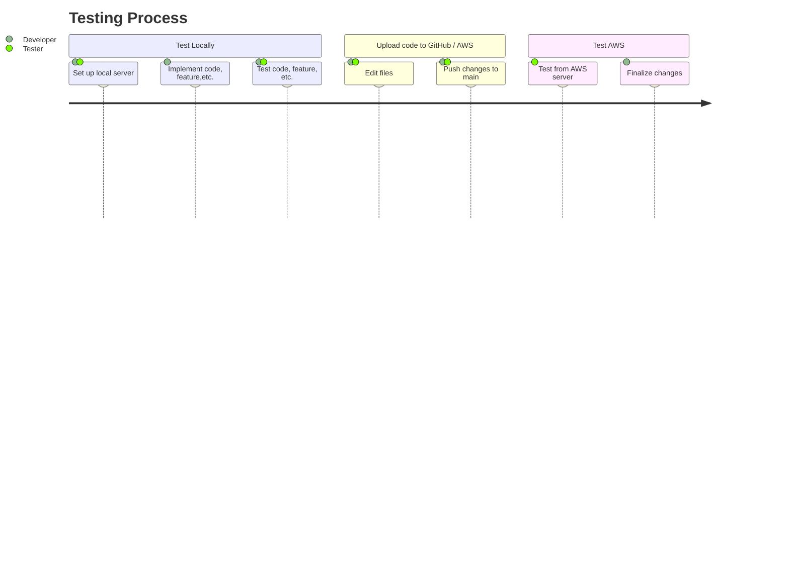

# Flashlite (Flashcard Generator) Test Plan

## Overview

This document outlines how to effectively test the Flashlite product, including recommended tools, testing strategies, and guidelines for validating new features and software updates.

You’ll find:

- Clear success criteria for feature testing

- Testing resources and templates

- Best practices for writing strong test plans

- Guidance for each testing phase throughout development

Our goal is to ensure consistent, reliable testing that supports a smooth and stable release process.

**Important Reminder:**
Always test your changes locally before pushing to the cloud-based server.

Pushing untested or broken code to the AWS environment can impact the entire team.

---

> ## **``Table of Contents``**

> ### <br>*Server Details*: <small>Characteristics of the local and cloud-based servers</small>
> ### <br>*Introduction*: <small>Overview of testing goals and responsibilities</small>
> ### <br>*Test Risks / Issues*: <small>Common risks and how to mitigate them</small>
> ### <br>*Diagram*: <small>Visual representation of the testing workflow</small>


> ### <br>*Testing Scope*: <small>Defines what will and won’t be tested</small>
> ### <br>*Test Plans / Strategies*: <small>Approaches, levels, and types of testing to be used</small>
> ### <br>*Using GitHub*: <small>Instructions for version control and testing collaboration</small>

> ### <br>*Test Case Templates*: <small>Reusable structures for writing test cases</small>


---

# <a name="_x7m16otabon9"></a><a name="_64tqgr9am01"></a>**Server Details** 

|**Server**|**Provider**|**URL**|
| :- | :- | :- |
|Local|Django|http://127.0.0.1:8000|
|Cloud|AWS|http://ec2-54-172-119-63.compute-1.amazonaws.com:8000/login_user?next=/home|


## Introduction
The purpose of this Test Plan is to ensure that all project deliverables align with the specifications outlined in the Statement of Required Services (SRS). By referencing the SRS, we can define which features and software components must be tested, as well as identify the most effective testing methods.

Testing is a shared responsibility between developers and testers. Ideally, at least one team member should test each piece of code locally before it is merged into the main branch. In some cases—such as the completion of a core feature—developers may take on the role of testers for their own work. While collaborative testing is encouraged, it is conditional based on the complexity and impact of the update. Ultimately, passing unit tests serve as confirmation that a piece of code performs as expected.

**Always test locally before pushing to the cloud-based server.**

* Use the local server for testing, debugging, and experimenting with new techniques.

* Use the cloud-based server only after local tests pass successfully.

## Test Risks / Issues

The following table outlines potential risks that may impact testing, along with mitigation strategies to address them:

| Test Plan Risk          | Mitigation Strategy                                                   |
| ----------------------- | --------------------------------------------------------------------- |
| Incomplete Requirements | Ensure all testing is guided by clearly defined requirements.         |
| Inadequate Resources    | Adjust the testing scope and prioritize critical paths.               |
| Undefined Scope         | Define specific goals and establish clear testing boundaries.         |
| Overwriting Code        | Use Git and maintain regular commits with clear messages.             |
| Insufficient Tools      | Apply manual testing methods, such as exploratory testing.            |
| Conflicting Code        | Use version control tools and communicate effectively with teammates. |
| Lack of Testing         | Assign another team member to test each newly implemented feature.    |
| Delayed Testing         | Create user stories and collaborate closely to stay on schedule.      |

## Diagram:



## Testing Scope

This section outlines the key features and functionalities that are within the scope of this test plan. It includes what will be tested, how it will be tested, when testing is expected to occur, and who is responsible.

**Note:** Items not included in this testing scope will be documented separately.

| Test Item              | Description                                              | Date | Responsibility       |
| ---------------------- | -------------------------------------------------------- | ---- | -------------------- |
| Set                    | Verify users can create and save new sets.               | N/A  | Tester & Developer   |
| Flashcard              | Verify users can add flashcards to sets.                 | N/A  | Tester & Developer   |
| Publishing             | Confirm that sets can be published successfully.         | N/A  | Tester               |
| Navigation             | Ensure smooth and logical user navigation flow.          | N/A  | Tester               |
| Pop-ups                | Confirm modals/pop-ups appear and function as expected.  | N/A  | Tester               |


### Test Levels and Test Types / Strategies

To ensure a thorough testing process, we apply different test levels and test types, each with a targeted strategy to validate the quality of the product.

| Test Level | Description                                                                      | Strategy                                                 |
| ---------- | -------------------------------------------------------------------------------  | -------------------------------------------------------- |
| System     | Verifies the entire software system functions as expected.                       | Ensure full end-to-end coverage.                         | 
| Acceptance | Validates that the system meets business and user requirements as per the SRS.   | Evaluate if the product is release-ready.                |


| Test Type  | Description                                                        | Strategy                                                      |
| ---------- | ------------------------------------------------------------------ | ------------------------------------------------------------- |
| Functional | Validates that each feature works according to the specifications. | Review implementation against requirements.                   |
| Usability  | Focuses on design intuitiveness and user satisfaction.	          | Collect feedback and refine the UX/UI.                        |
| Regression | Ensures that new changes haven’t introduced new bugs.              | Prioritize high-risk areas and retest core functionality. |

A solid testing strategy involves more than just executing test cases. Each test—whether it’s a unit test or part of a **user story**—should be well-documented and traceable to the feature or requirement it validates. Well-structured, repeatable test cases are key to ensuring the reliability of both new and existing functionality.

## Using GitHub / Git

### GitHub Issues
GitHub Issues are versatile tools designed to help plan, track, and discuss testing. In the repository, you can create Issues to document bugs or flag features that need testing. Users can assign Issues to themselves or others on the team.

Because Issues support Markdown formatting, the templates provided in this document can be pasted directly into an Issue. An Issue should be marked open while testing is ongoing, and closed once testing is complete.

* **Tip:** Let your team know when you open an Issue—especially those assigned to it.

Using Issues before opening a pull request helps speed up code reviews and keeps testing transparent. Even after testing is complete, you can retroactively create an Issue for documentation purposes.

### Git
There are multiple ways to access the GitHub repository.

### Option 1: Download as a Zip
Navigate to the repository

Click the green Code button

Select Download ZIP

Unzip the folder on your machine and extract what you need

### Option 2: Use Git Bash
Download Git Bash

Git Bash gives you a terminal interface to interact with Git.

#### To clone a full repository:

``
git clone <repository-url>
``

Replace <repository-url> with the URL found under the Code button on GitHub.

#### To clone to a specific directory:

``
git clone <repository-url> <directory>
``

Git will create the <directory> if it doesn’t already exist

#### Clone a specific branch:

To clone a specific branch:

Use the ``b`` option with ``git clone``:

``
git clone -b <branch-name> <repository-url>
``

Replace ``<branch-name>`` with the name of the branch you want to clone.

### GitHub DeskTop

GitHub Desktop provides a user-friendly GUI to interact with Git and GitHub without needing the command line. It is the recommended tool for managing pull requests, testing branches, and reviewing commits.

More guidance on using GitHub Desktop for testing can be found in the TESTGUIDE.md file.

Plain text URL: ```https://desktop.github.com/download/```

# Test Case Templates

**These are templates.**

Please do not fill them out in this document. Instead, copy them into your own testing documentation or GitHub Issues when needed.


| Test Item | Description | Date | Responsibility |
| --------- | ----------- | ---- | -------------- |
|           |             |      |                |
|           |             |      |                |
|           |             |      |                |
|           |             |      |                |
|           |             |      |                |


| Prepared by: | Assigned to: | Scope | Objective | Approach | Environment |
| ------------ | ------------ | ----- | --------- | -------- | ----------- |
|              |              |       |           |          |             |
|              |              |       |           |          |             |
|              |              |       |           |          |             |
|              |              |       |           |          |             |
|              |              |       |           |          |             |

| Test Case ID | Test Scenario | Test Case | Pre-Condition | Test Steps | Test Data | Expected Result | Actual Result | Status (Pass/Fail) |
| ------------ | ------------- | --------- | ------------- | ---------- | --------- | --------------- | ------------- | ------------------ |
|              |               |           |               |            |           |                 |               |                    |
|              |               |           |               |            |           |                 |               |                    |
|              |               |           |               |            |           |                 |               |                    |
|              |               |           |               |            |           |                 |               |                    |
|              |               |           |               |            |           |                 |               |                    |
