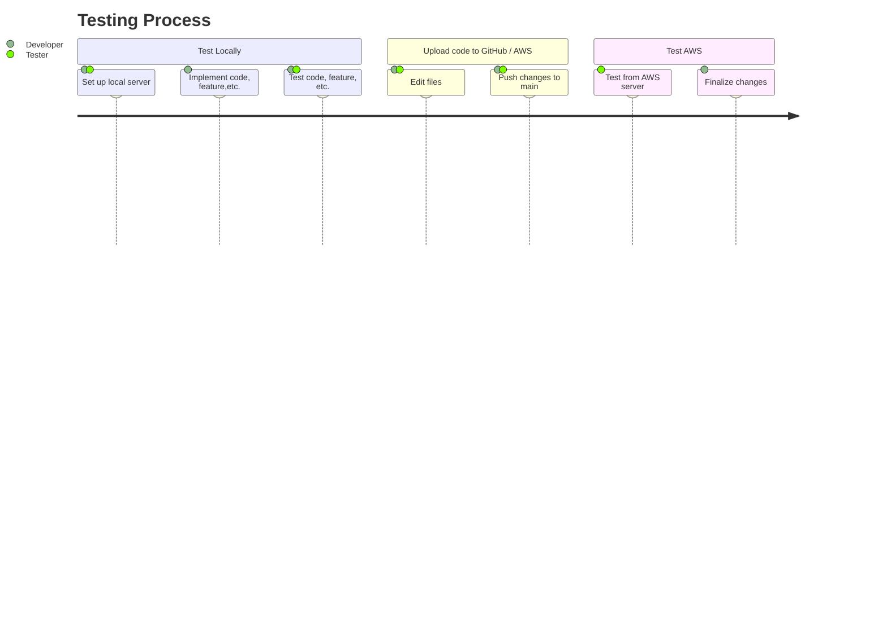

# Flashcard Generator Test Plan Template

## Overview

The following will outline how to test our product, including what tools and strategies to use. Expect to find resources, templates, and success criteria for testing specific new features and software. 


This document will ensure you make solid test plans and understand the testing phases and developmental processes necessary for delivering a successful product.


**Remember to test locally first before uploading code to our cloud-based server.**

Please review the **TESTGUIDE.md** document for information on going between servers for testing purposes.

---

> ## **``Table of Contents``**

> ### <br>*Server Details*: <small>The characteristics of the separate servers</small>
> ### <br>*Introduction*: <small>General testing information</small>
> ### <br>*Test Risks / Issues*: <small>Identify and avoid the risks</small>
> ### <br>*Diagram*: <small>Visual aid on testing processes</small>


> ### <br>*Testing Scope*: <small>Defines the extent of testing</small>
> ### <br>*Test Plans / Strategies*: <small>How testing will be conducted</small>
> ### <br>*Using GitHub*: <small>How to use GitHub for testing purposes</small>

> ### <br>*Test Case Templates*: <small>Templates for use in making test cases</small>


---

# <a name="_x7m16otabon9"></a><a name="_64tqgr9am01"></a>**Server Details** 

|**Server**|**Provider**|**URL**|
| :- | :- | :- |
|Local|Django|http://127.0.0.1:8000|
|Cloud|AWS|http://ec2-54-172-119-63.compute-1.amazonaws.com:8000/login_user?next=/home|


## Introduction
The purpose of the Test Plan for this specific project is to ensure we fulfill the deliverables outlined in our Statement of Required Services (SRS). By referencing the requirements specified in the SRS, we can define what features and software to test and how to test them most effectively.

''

''

* **Remember** to use the **local server** for **testing** and **learning** code techniques.


* **Remember** to use the **cloud-based server** after local tests **pass**.

## Test Risks / Issues

Here are the risks associated with our test plan and their mitigation strategies.

| Test Plan Risk          | Mitigation Strategy                                               |
| ----------------------- | ----------------------------------------------------------------- |
| Incomplete Requirements | Specify clear requirements for testing.                           |
| Inadequate Resources    | Adjust the scope of testing and priortize.                        |
| Undefined Scope         | Identify the goal and determine the purpose.                      |
| Overwriting Code        | Utilize Git or other version control software.                    |
| Insufficient Tools      | Resort to manual testing techniques like exploratory testing.     |
| Conflicting Code        | Communicate the problem and use version control.                  |
| Lack of Testing         | Ask team members to test a newly-implemented feature or function. |
| Delayed Testing         | Work collaboratively and create user stories.                     |

## Diagram:



## Testing Scope

Here is information regarding the items/features/functions that will be tested, how they'll be tested, when, and who will test them.

**Items not in the scope of this test plan will be listed seperately.**

| Test Item              | Description                            | Date | Responsibility       |
| ---------------------- | -------------------------------------- | ---- | -------------------- |
| Deck                   | Test if user can create decks.         | N/A  | Tester & Developer   |
| Flashcard              | Test if user can create flashcards.    | N/A  | Tester & Developer   |
| Publishing             | Test if user can publish decks.        | N/A  | Tester               |
| Navigation             | Test if user can navigate efficiently. | N/A  | Tester               |
| Pop-ups                | Test if pop-ups function and appear.   | N/A  | Developer            |


### Test Levels and Test Types / Strategies

Here are the test plans and their strategies that will help prioritize the testing efforts and explain the techniques and approaches necessary for success.

| Test Level | Description                                                                      | Strategy                                                 |
| ---------- | -------------------------------------------------------------------------------  | -------------------------------------------------------- |
| System     | Tests a complete and fully integrated software product.                          |  Cover all the paths.                                    | 
| Acceptance | Tests whether it meets user needs and Software Requirements Specification (SRS). |  Determine if it is ready for release.                   |


| Test Type  | Description                                              | Strategy                                                     |
| ---------- | -------------------------------------------------------- | ------------------------------------------------------------ |
| Functional | Verifies that features and functions work as intended.   | Review and validate each feature.                            |
| Usability  | Makes the design more user-friendly and intuitive.       | Identify feedback and improve the user experience.           |
| Regression | Ensures new code has not broken previously working code. | Take a risk-based approach and diagnose high-priority areas. |

''

### Using GitHub / Git

```Not yet implemented.```

# Test Case Templates

**The following are templates.** 

Avoid filling out test cases in this document.

You can copy the code for use in testing documentation. 


| Test Item | Description | Date | Responsibility |
| --------- | ----------- | ---- | -------------- |
|           |             |      |                |
|           |             |      |                |
|           |             |      |                |
|           |             |      |                |
|           |             |      |                |


| Prepared by: | Assigned to: | Scope | Objective | Approach | Environment |
| ------------ | ------------ | ----- | --------- | -------- | ----------- |
|              |              |       |           |          |             |
|              |              |       |           |          |             |
|              |              |       |           |          |             |
|              |              |       |           |          |             |
|              |              |       |           |          |             |

| Test Case ID | Test Scenario | Test Case | Pre-Condition | Test Steps | Test Data | Expected Result | Actual Result | Status (Pass/Fail) |
| ------------ | ------------- | --------- | ------------- | ---------- | --------- | --------------- | ------------- | ------------------ |
|              |               |           |               |            |           |                 |               |                    |
|              |               |           |               |            |           |                 |               |                    |
|              |               |           |               |            |           |                 |               |                    |
|              |               |           |               |            |           |                 |               |                    |
|              |               |           |               |            |           |                 |               |                    |
