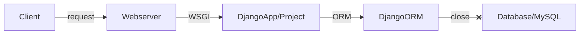
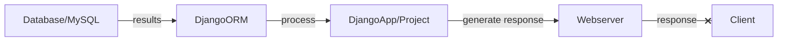
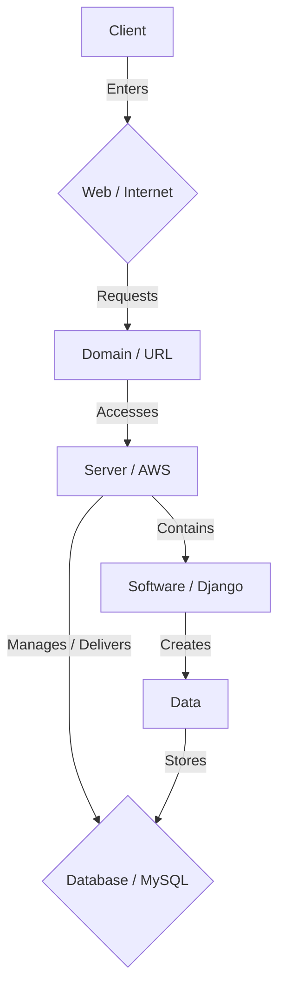
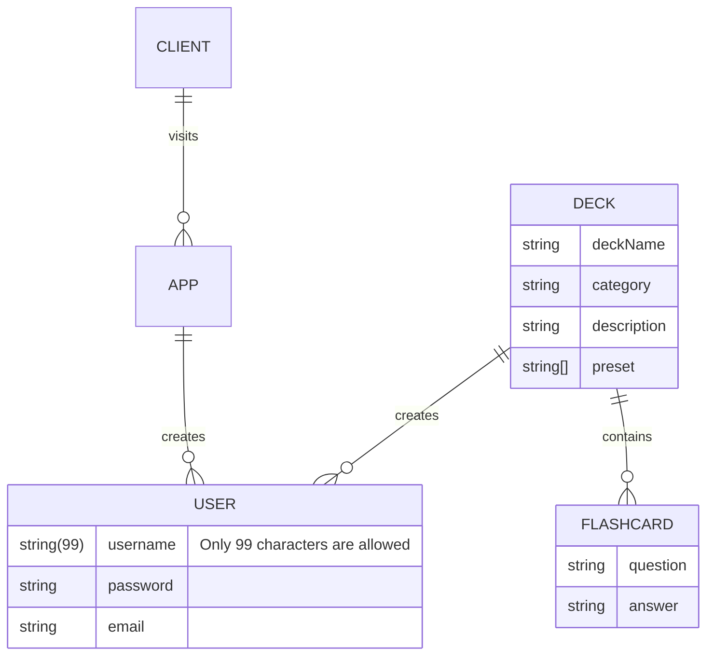
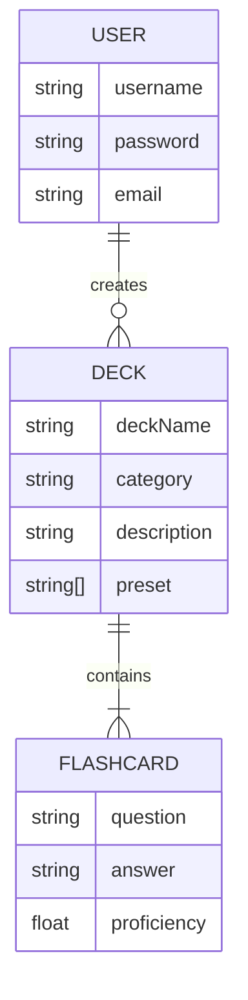

# Flashcard Generator User Guide

## Scope & Overview

The following guide will provide instructions for using our software/system, describe how users work, and describe the tasks they perform. It will also document every menu, function, and procedure in our application. This will include any precautions necessary to circumvent errors and malfunctions.

---

> ## **``Table of Contents``**

> ###  *Introduction*: <small>Explain the product, functionalities, and organization of sections</small>
> ###  *Process*: <small>Define the process for using the product</small>
> ###  *Diagram*: <small>Visual aid on user interaction</small>

> ###  *Workflow*: <small>Describe the tasks for achieving specific goals</small>
> ###  *Instructions*: <small>Step-by-step on user interactions</small>
> ###  *Conventions*: <small>Rules for naming, coloring, and grouping code</small>

> ###  *Errors & Malfunctions*: <small>Precautionary procedures in case of emergency</small>

---

## Introduction

### Process

### Diagram:

## Workflow

### Instructions

### Conventions

## Errors & Malfunctions
