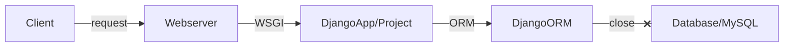
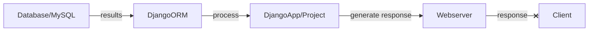
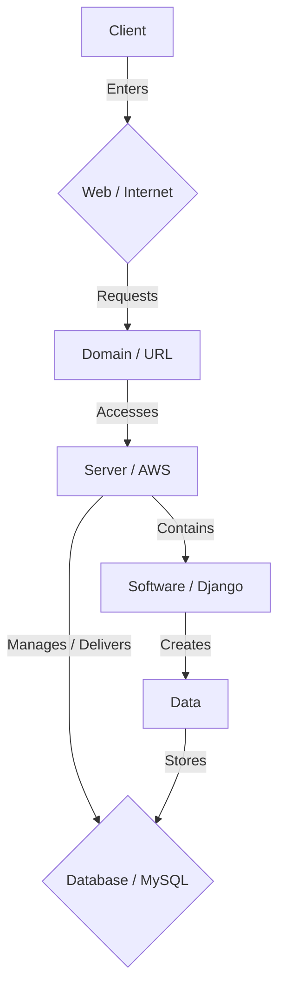
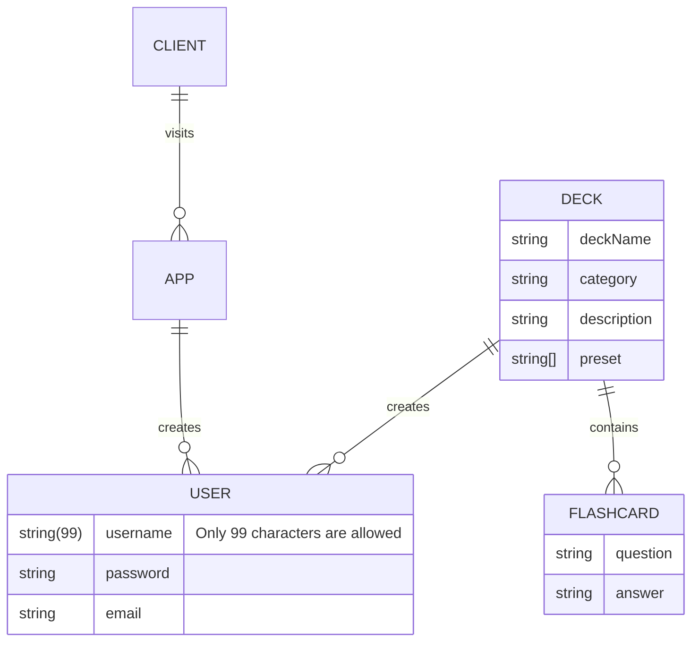
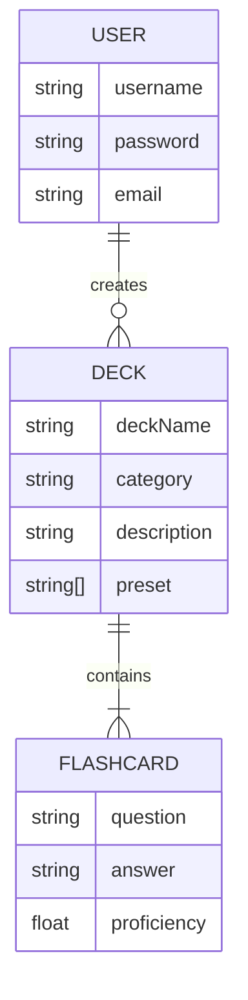

# Flashcard Generator User Guide

## Scope & Overview

The following guide will provide instructions for using our software/system, describe how users work, and define the tasks they perform. It will also document every menu, function, and procedure in our application. This will include any precautions necessary to circumvent errors and malfunctions.

---

> ## **``Table of Contents``**

> ###  *Introduction*: <small>Explain the product, functionalities, and organization of sections</small>
> ###  *Process*: <small>Define the process for using the product</small>
> ###  *Diagram*: <small>Visual aid on user interaction</small>

> ###  *Workflow*: <small>Describe the tasks for achieving specific goals</small>
> ###  *Instructions*: <small>Step-by-step on user interactions</small>
> ###  *Conventions*: <small>Rules for naming, coloring, and grouping code</small>

> ###  *Errors & Malfunctions*: <small>Precautionary procedures in case of emergency</small>

---

## Introduction
**1.1 Intended use and unintended use**

FlashLite is an interactive, free-to-use website intended for creating, storing, and sharing decks of flashcards. The website should be accessed on a desktop, from a browser, through a URL. Anyone can use the site, though it is purposefully designed with students and instructors in mind.

This website should be used to:
>* Create and share appropriate, informative flashcard decks suitable for learning.
>* Study and gain knowledge in many academic and non-academic subjects.
>* Get feedback on the learning level, proficiency, and mastery of concepts.
>* Collaborate formally with other users through a shared, safe space.

This website should not be used to:
>* Share offensive, inappropriate, or otherwise harmful content. 
>* Social network, conversate or connect with other users informally. 
>* Cheat, plagiarize or steal the works of others.
>* Publish misinformation or other inaccurate and otherwise false information

This website may only be used according to its instructions as defined in this guide. All uses other than those directly stated within this guide are seen as unintended use.

**1.2 General working principle**

This website's online platform is designed to help users study through interactive flashcard tools and allow them to create their decks and study sets to enhance their learning experience.

The digital flashcard system can create curriculums, goals, and instructional methods on various topics by allowing users to design their cards. Users can access and utilize these decks and share them for others on the platform to see and use. 

There are two ways to learn and interact with this website:
- Creating your decks of flashcards for personal use or sharing.
- Utilizing the public library of decks other users have created and shared.

### Process
**2.1 How to navigate and utilize the site features**

To traverse the site, users have access to a navigational bar. This bar is available on every page for users that are logged in. It allows free exploration and use of all the site's functions and features. 

These pages include:

- *Home* - Also known as 'Study Time', this page automatically displays cards from the user's favorite decks.

- *Create Flashcards* - This page allows users to create and customize their flashcards and decks.

- *The Library* - In the library, users can find their decks and the decks other users have published to the site. Users can edit and manage their decks and flashcards from this page.

- *Settings* - Users can access settings to change their passwords, delete their accounts, view their credentials, and make other account configurations. 

- *Favorite Decks* - The user's favorite decks will appear in this drop-down menu. It conveniently lets them quickly access a deck from their favorites without searching for it in the library. 

- *Contact* - Users can contact support and find links to all the site's social media accounts and services.

- *About* - The site's Terms of Service (ToS) and other important legal documentation regarding the rules and regulations for using the product and service can be found here.

### Diagram:

## Workflow

**3.1 Understanding and documenting workflows**

The key aspects of FlashLite's workflow:

> - **Creating a deck:** Starting by adding a title, category, and description, users can create a deck for holding flashcards.
> - **Adding flashcards:** Whether terms and definitions or questions and answers, users can name their flashcards and customize the front and back sides of their cards.
> - **Organizing and favoriting decks:** Arrange decks into categories and favorite decks to easily reference them later.
> - **Studying with different modes:** Choose from multiple-choice options or practice writing answers.
> - **Reviewing progress and proficiency:** Track your performance with statistics like proficiency, and identify areas requiring further study.
> - **Sharing decks with other users:** Users can make their decks public from the library so other users can engage with them and collaboratively learn. 

### Instructions

**4.1 Quickstart guide for a smooth and effective flashcard creating experience**

Step 1. Open a browser and access the site's URL.

Step 2. Existing users log in. New users sign up.

Step 3. Access the flashcard deck creation tool to create a deck.

Step 4. Create and fill your deck with individual flashcards.

Step 5. Share your deck with other users or begin studying.

### Conventions
**5.1 Formatting decks and flashcards**

Decks consist of three main pieces of information: A deck name, category, and description.

Deck names should be unique and are the main source of identification for your deck. It is not possible to have decks with the same name. 

The category classifies your deck by subject, concept, or other means. Decks are grouped based on whether or not they share a category. 

The description is an optional means for describing the contents of your deck at length. Descriptions should be relevant to their deck's contents.

Flashcards consist of three main pieces of information: A flashcard name, a question, and an answer.

Flashcard names should be unique and are the main source for identifying your flashcards. Cards in the same deck cannot share a name.

The question section of a flashcard is for posing a question, query, or other answerable statement. 

The answer section of a flashcard can have multiple correct and incorrect answers. Answer sections can be in multiple-choice format or allow the user to type a single response.

## Errors & Malfunctions

**6.1 Things to avoid**

Existing users should not attempt to create additional accounts using the same email.
