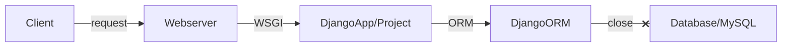
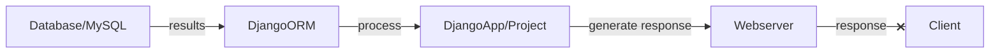
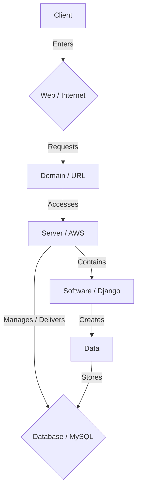
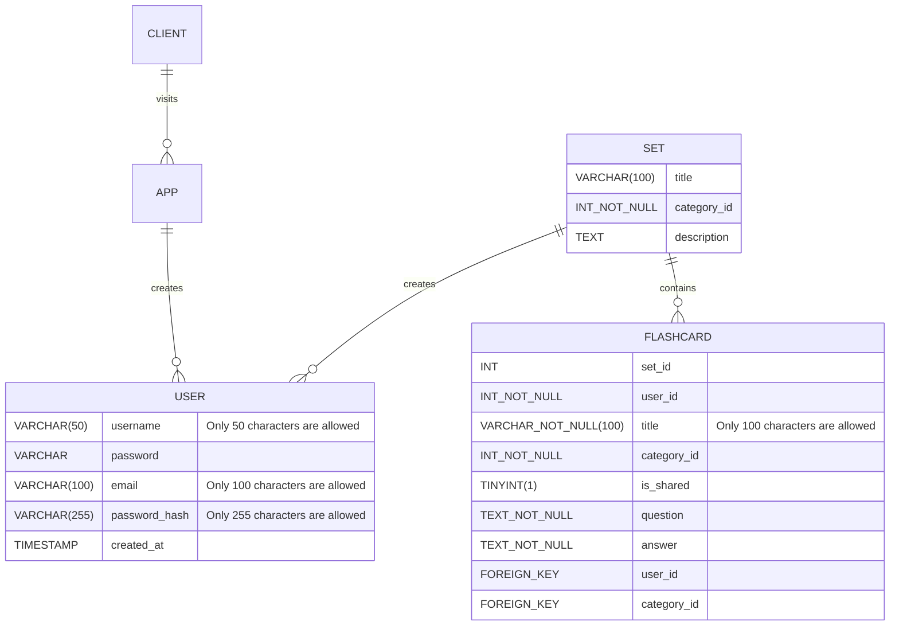
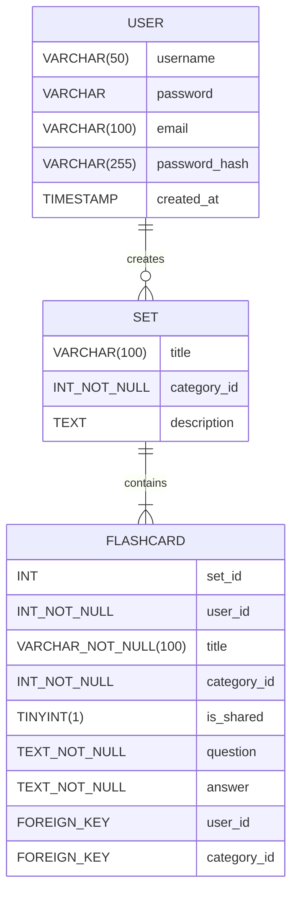

# Flashlite (Flashcard Generator) User Guide

## Scope & Overview

The following guide will provide instructions for using our software/system, describe how users work, and define the tasks they perform. It will also document every menu, function, and procedure in our application. This will include any precautions necessary to circumvent errors and malfunctions.

---

> ## **``Table of Contents``**

> ###  *Introduction*: <small>Explain the product, functionalities, and organization of sections</small>
> ###  *Process*: <small>Define the process for using the product</small>
> ###  *Diagram*: <small>Visual aid on user interaction</small>

> ###  *Workflow*: <small>Describe the tasks for achieving specific goals</small>
> ###  *Instructions*: <small>Step-by-step on user interactions</small>
> ###  *Conventions*: <small>Rules for naming, coloring, and grouping code</small>

> ###  *Errors & Malfunctions*: <small>Precautionary procedures in case of emergency</small>

---

## Introduction
**1.1 Intended use and unintended use**

FlashLite is an interactive, free-to-use website intended for creating, storing, and sharing sets of flashcards. The website should be accessed on a desktop, from a browser, through a URL. Anyone can use the site, though it is purposefully designed with students and instructors in mind.

This website should be used to:
>* Create and share appropriate, informative flashcard decks suitable for learning.
>* Study and gain knowledge in many academic and non-academic subjects.
>* Get feedback on the learning level, proficiency, and mastery of concepts.
>* Collaborate formally with other users through a shared, safe space.

This website should not be used to:
>* Share offensive, inappropriate, or otherwise harmful content. 
>* Social network, conversate or connect with other users informally. 
>* Cheat, plagiarize or steal the works of others.
>* Publish misinformation or other inaccurate and otherwise false information

This website may only be used according to its instructions as defined in this guide. All uses other than those directly stated within this guide are seen as unintended use.

**1.2 General working principle**

This website's online platform is designed to help users study through interactive flashcard tools and allow them to create their sets and study sets to enhance their learning experience.

The digital flashcard system can create curriculums, goals, and instructional methods on various topics by allowing users to design their cards. Users can access and utilize these sets and share them for others on the platform to see and use. 

There are two ways to learn and interact with this website:
- Creating your sets of flashcards for personal use or sharing.
- Utilizing the public library of sets other users have created and shared.

### Process
**2.1 How to navigate and utilize the site features**

To traverse the site, users have access to a navigational bar. This bar is available on every page for users that are logged in. It allows free exploration and use of all the site's functions and features. 

These pages include:

- *Home* - Also known as 'Study Time', this page automatically displays cards from the user's recent sets.

- *Create Flashcards* - This page allows users to create and customize their flashcards and sets.

- *The Library* - In the library, users can find their sets. Users can edit and manage their dsets and flashcards from this page.

- *World Sets* - Here users can find sets that other users have published to the site.

- *Settings* - Users can access settings to change their passwords, delete their accounts, view their credentials, and make other account configurations. 

- *Recent sets* - The user's recent sets will appear in this drop-down menu. It conveniently lets them quickly access a set they recently accessed without searching for it in the library. 

- *Contact* - Users can contact support and find links to all the site's social media accounts and services.

- *About* - The site's Terms of Service (ToS) and other important legal documentation regarding the rules and regulations for using the product and service can be found here.

### Diagram:

## Workflow

**3.1 Understanding and documenting workflows**

The key aspects of FlashLite's workflow:

> - **Creating a set:** Starting by adding a title, category, and description, users can create a set for holding flashcards.
> - **Adding flashcards:** Whether terms and definitions or questions and answers, users can name their flashcards and customize the front and back sides of their cards.
> - **Organizing and favoriting sets:** Arrange sets into categories and favorite sets to easily reference them later.
> - **Reviewing progress and proficiency:** Track your performance with statistics, and identify areas requiring further study.
> - **Sharing sets with other users:** Users can make their sets public from the library so other users can engage with them and collaboratively learn. 

### Instructions

**4.1 Quickstart guide for a smooth and effective flashcard creating experience**

Step 1. Open a browser and access the site's URL.

Step 2. Existing users log in. New users sign up.

Step 3. Access the flashcard set creation tool to create a deck.

Step 4. Create and fill your set with individual flashcards.

Step 5. Share your set with other users or begin studying.

### Conventions
**5.1 Formatting decks and flashcards**

Sets consist of three main pieces of information: A set name, category, and description.

Set names should be unique and are the main source of identification for your set. It is not possible to have sets with the same name. 

The category classifies your set by subject, concept, or other means. Sets are grouped based on whether or not they share a category. 

The description is an optional means for describing the contents of your set at length. Descriptions should be relevant to their set's contents.

Flashcards consist of three main pieces of information: A flashcard name, a question, and an answer.

Flashcard names should be unique and are the main source for identifying your flashcards. Cards in the same set cannot share a name.

The question section of a flashcard is for posing a question, query, or other answerable statement. 

## Errors & Malfunctions

**6.1 Things to avoid**

Existing users should not attempt to create additional accounts using the same email.
